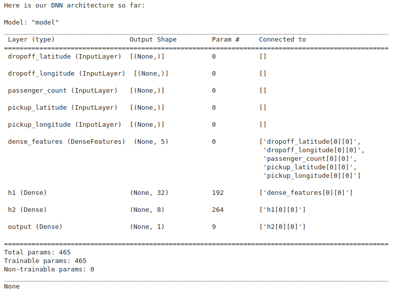
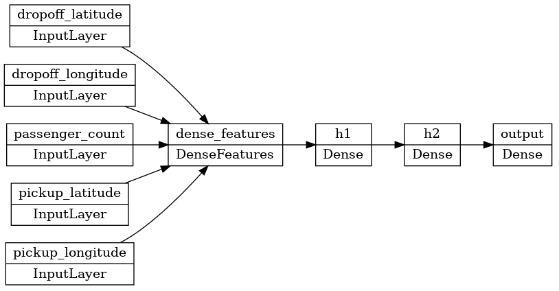
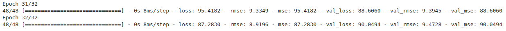
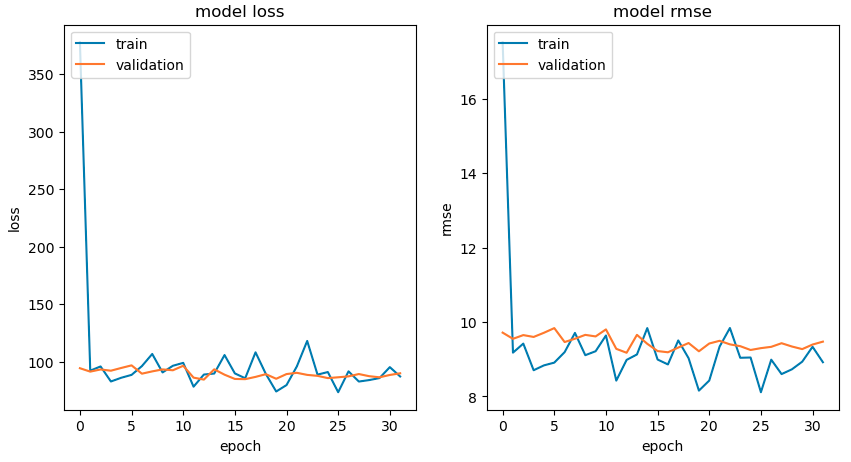

# Lab: Build a DNN using the Keras Functional API (on Vertex AI Platform)

## Summary

- [training-data-analyst](https://github.com/GoogleCloudPlatform/training-data-analyst)/[courses](https://github.com/GoogleCloudPlatform/training-data-analyst/tree/master/courses)/[machine_learning](https://github.com/GoogleCloudPlatform/training-data-analyst/tree/master/courses/machine_learning)/[deepdive2](https://github.com/GoogleCloudPlatform/training-data-analyst/tree/master/courses/machine_learning/deepdive2)/[**art_and_science_of_ml** ](https://github.com/GoogleCloudPlatform/training-data-analyst/tree/master/courses/machine_learning/deepdive2/art_and_science_of_ml )/ [**solutions**](https://github.com/GoogleCloudPlatform/training-data-analyst/tree/master/courses/machine_learning/deepdive2/art_and_science_of_ml/solutions) / [neural_network.ipynb](https://github.com/GoogleCloudPlatform/training-data-analyst/blob/master/courses/machine_learning/deepdive2/art_and_science_of_ml/solutions/neural_network.ipynb)
- I've added some additional comments in the following lines.
- Each learning objective will correspond to a #TODO in the student lab notebook

## Introduction

* Purpose: predict the fare amount for NYC taxi cab rides
* **Build a deep neural network model** with 
  - **Keras Functional APIs** (not Sequential API)

## Learning objectives

1. Review how to read in CSV file data using tf.data.
2. Specify input, hidden, and output layers in the DNN architecture.
3. Review and visualize the final DNN shape.
4. Train the model locally and visualize the loss curves.
5. **Deploy and predict with the model using Cloud AI Platform**.

## Excerpts from the solution `.ipynb`

### [Keras > Developer guides > The Functional API](https://keras.io/guides/functional_api/)

#### Introduction

The Keras *functional API* is a way to create models that are more flexible than the [`tf.keras.Sequential`](https://keras.io/api/models/sequential#sequential-class) API. **The functional API can handle models with** 

- **non-linear topology,** 
- **shared layers, and even** 
- **multiple inputs or outputs.**

The main idea is that a deep learning model is usually a directed acyclic graph (DAG) of layers. So the functional API is a way to build *graphs of layers*.

**Start by creating an input node**

```python
inputs = keras.Input(shape=(784,))
```

For example, if you have an image input with a shape of (32, 32, 3),

```python
# Just for demonstration purposes.
img_inputs = keras.Input(shape=(32, 32, 3))
inputs.dtype
# tf.float32
inputs.shape
# TensorShape([None, 784])
```

Create a new node in the graph of layers by calling a layer on this `inputs` object

```python
dense = layers.Dense(64, activation="relu")
x = dense(inputs)
```

Add a few more layers to the graph of layers

```python
x = layers.Dense(64, activation="relu")(x)
outputs = layers.Dense(10)(x)
```

At this point, you can create a Model by specifying its inputs and outputs in the graph of layers.

```python
model = keras.Model(inputs=inputs, outputs=outputs, name="mnist_model")
model.summary()
```

```
Model: "mnist_model"
_________________________________________________________________
 Layer (type)                Output Shape              Param #   
=================================================================
 input_1 (InputLayer)        [(None, 784)]             0         

 dense (Dense)               (None, 64)                50240     

 dense_1 (Dense)             (None, 64)                4160      

 dense_2 (Dense)             (None, 10)                650       

=================================================================
Total params: 55,050
Trainable params: 55,050
Non-trainable params: 0
_________________________________________________________________
```

You can plot the model as a graph.

```python
keras.utils.plot_model(model, "my_first_model.png")
```

Optionally, display the input and output shapes of each layer in the plotted graph.

```python
keras.utils.plot_model(model, "my_first_model_with_shape_info.png", show_shapes=True)
```

### Training, evaluation, and inference

Training, evaluation, and inference work exactly in the same way for models built using the functional API as for `Sequential` models. Refer to the model [serialization & saving](https://keras.io/guides/serialization_and_saving/) guide for more details.

#### Example with the MNIST dataset

```python
# Fetch & prepare the MNIST dataet
(x_train, y_train), (x_test, y_test) = keras.datasets.mnist.load_data()
x_train = x_train.reshape(60000, 784).astype("float32") / 255
x_test = x_test.reshape(10000, 784).astype("float32") / 255

# Compile, train and evaluate the model
model.compile(
    loss=keras.losses.SparseCategoricalCrossentropy(from_logits=True),
    optimizer=keras.optimizers.RMSprop(),
    metrics=["accuracy"],
)
history = model.fit(x_train, y_train, batch_size=64, epochs=2, validation_split=0.2)
test_scores = model.evaluate(x_test, y_test, verbose=2)
print("Test loss:", test_scores[0])
print("Test accuracy:", test_scores[1])

# Save and serialize
model.save("path_to_my_model")
del model
# Recreate the exact same model purely from the file:
model = keras.models.load_model("path_to_my_model")
```

### EDA

```python
import pandas as pd

train_csv2df = pd.read_csv("../data/toy_data/taxi-traffic-train_toy.csv")
train_csv2df.head()
```

```
	6.1	2	0	-73.98689499999999	40.729723	-74.00631	40.739407	1129
0	9.7	7	0	-73.945783	40.777807	-73.975390	40.757712	2876
1	5.3	6	0	-74.006440	40.739349	-73.999379	40.731804	3950
2	7.3	5	0	-73.966118	40.753983	-73.945605	40.782802	1334
3	6.5	7	0	-73.974153	40.762767	-73.989152	40.742727	2623
4	22.9	1	0	-73.977188	40.774063	-73.962647	40.654768	2833
```

#### Test with `tf.data.experimental.make_csv_dataset`

https://www.tensorflow.org/api_docs/python/tf/data/experimental/make_csv_dataset

```python
pattern="../data/toy_data/taxi-traffic-train_toy.csv"
batch_size=1

tf.data.experimental.make_csv_dataset(pattern, batch_size)
```

```
<PrefetchDataset element_spec=OrderedDict([('6.1', TensorSpec(shape=(1,), dtype=tf.float32, name=None)), ('2', TensorSpec(shape=(1,), dtype=tf.int32, name=None)), ('0', TensorSpec(shape=(1,), dtype=tf.int32, name=None)), ('-73.98689499999999', TensorSpec(shape=(1,), dtype=tf.float32, name=None)), ('40.729723', TensorSpec(shape=(1,), dtype=tf.float32, name=None)), ('-74.00631', TensorSpec(shape=(1,), dtype=tf.float32, name=None)), ('40.739407', TensorSpec(shape=(1,), dtype=tf.float32, name=None)), ('1129', TensorSpec(shape=(1,), dtype=tf.int32, name=None))])>
```


```python
CSV_COLUMNS  = ['fare_amount',  'pickup_datetime',
                'pickup_longitude', 'pickup_latitude', 
                'dropoff_longitude', 'dropoff_latitude', 
                'passenger_count', 'key']

tf.data.experimental.make_csv_dataset(pattern, batch_size, CSV_COLUMNS)
```

```
<PrefetchDataset element_spec=OrderedDict([('fare_amount', TensorSpec(shape=(1,), dtype=tf.float32, name=None)), ('pickup_datetime', TensorSpec(shape=(1,), dtype=tf.int32, name=None)), ('pickup_longitude', TensorSpec(shape=(1,), dtype=tf.int32, name=None)), ('pickup_latitude', TensorSpec(shape=(1,), dtype=tf.float32, name=None)), ('dropoff_longitude', TensorSpec(shape=(1,), dtype=tf.float32, name=None)), ('dropoff_latitude', TensorSpec(shape=(1,), dtype=tf.float32, name=None)), ('passenger_count', TensorSpec(shape=(1,), dtype=tf.float32, name=None)), ('key', TensorSpec(shape=(1,), dtype=tf.int32, name=None))])>
```


```python
DEFAULTS     = [[0.0],['na'],[0.0],[0.0],[0.0],[0.0],[0.0],['na']]

tf.data.experimental.make_csv_dataset(pattern, batch_size, CSV_COLUMNS, DEFAULTS)
```

```
<PrefetchDataset element_spec=OrderedDict([('fare_amount', TensorSpec(shape=(1,), dtype=tf.float32, name=None)), ('pickup_datetime', TensorSpec(shape=(1,), dtype=tf.string, name=None)), ('pickup_longitude', TensorSpec(shape=(1,), dtype=tf.float32, name=None)), ('pickup_latitude', TensorSpec(shape=(1,), dtype=tf.float32, name=None)), ('dropoff_longitude', TensorSpec(shape=(1,), dtype=tf.float32, name=None)), ('dropoff_latitude', TensorSpec(shape=(1,), dtype=tf.float32, name=None)), ('passenger_count', TensorSpec(shape=(1,), dtype=tf.float32, name=None)), ('key', TensorSpec(shape=(1,), dtype=tf.string, name=None))])>
```

The output result looks identical at this point.

```python
tf.data.experimental.make_csv_dataset(pattern, batch_size, CSV_COLUMNS, DEFAULTS).map()
```

An example without the label specified.

```python
# No label column specified
dataset = tf.data.experimental.make_csv_dataset(filename, batch_size=2)
iterator = dataset.as_numpy_iterator()
print(dict(next(iterator)))
# prints a dictionary of batched features:
# OrderedDict([('Feature_A', array([1, 4], dtype=int32)),
#              ('Feature_B', array([b'a', b'd'], dtype=object))])
```

An example to specify the label.

```python
# Set Feature_B as label column
dataset = tf.data.experimental.make_csv_dataset(
    filename, batch_size=2, label_name="Feature_B")
iterator = dataset.as_numpy_iterator()
print(next(iterator))
# prints (features, labels) tuple:
# (OrderedDict([('Feature_A', array([1, 2], dtype=int32))]),
#  array([b'a', b'b'], dtype=object))
```

Like the above example, we can simply specify the label_name as follows if we don't have unwanted columns.

```python
    dataset = tf.data.experimental.make_csv_dataset(
        pattern, batch_size, CSV_COLUMNS, DEFAULTS, label_name="fare_amount"
    )
```

The `.map` method is used to remove the unwanted columns and then assign the label.

```py
dataset = dataset.map(features_and_labels)
```

## Source Code

After `git clone`, go to the direct where the `.ipynb` is located.

```
cd training-data-analyst/courses/machine_learning/deepdive2/art_and_science_of_ml/labs/
```


```
!sudo chown -R jupyter:jupyter /home/jupyter/training-data-analyst
```

```
# Locating the CSV files
!ls -l ../data/toy_data/*.csv
```

```
-rw-r--r-- 1 jupyter jupyter 1111933 Dec 27 13:19 ../data/toy_data/taxi-traffic-test_toy.csv
-rw-r--r-- 1 jupyter jupyter 4772181 Dec 27 13:19 ../data/toy_data/taxi-traffic-train_toy.csv
-rw-r--r-- 1 jupyter jupyter 1038564 Dec 27 13:19 ../data/toy_data/taxi-traffic-valid_toy.csv
```


```python
import os, json, math
import numpy as np
import tensorflow as tf
# Python shutil module enables us to operate with file objects easily and without diving into file objects a lot.
import shutil

print("TensorFlow version: ",tf.version.VERSION)
os.environ['TF_CPP_MIN_LOG_LEVEL'] = '3' # SET TF ERROR LOG VERBOSITY

# Use tf.data to read the CSV files
# Define columns of data
CSV_COLUMNS  = ['fare_amount',  'pickup_datetime',
                'pickup_longitude', 'pickup_latitude', 
                'dropoff_longitude', 'dropoff_latitude', 
                'passenger_count', 'key']
LABEL_COLUMN = 'fare_amount'
DEFAULTS     = [[0.0],['na'],[0.0],[0.0],[0.0],[0.0],[0.0],['na']]

# Define features you want to use
def features_and_labels(row_data):
    for unwanted_col in ['pickup_datetime', 'key']:
        row_data.pop(unwanted_col)
    label = row_data.pop(LABEL_COLUMN)
    return row_data, label  # features, label

# load the training data
def load_dataset(pattern, batch_size=1, mode=tf.estimator.ModeKeys.EVAL):
  dataset = (tf.data.experimental.make_csv_dataset(pattern, batch_size, CSV_COLUMNS, DEFAULTS)
             .map(features_and_labels) # features, label
             )
  if mode == tf.estimator.ModeKeys.TRAIN:
        dataset = dataset.shuffle(1000).repeat()
  dataset = dataset.prefetch(1) # take advantage of multi-threading; 1=AUTOTUNE
  return dataset

# Build a DNN with Keras using Functional APIs (not Sequential API)
def rmse(y_true, y_pred):
    return tf.sqrt(tf.reduce_mean(tf.square(y_pred - y_true))) 

def build_dnn_model():
    INPUT_COLS = ['pickup_longitude', 'pickup_latitude', 
                  'dropoff_longitude', 'dropoff_latitude', 
                  'passenger_count']
    # TODO 2
    # I changed the order of feature_columns and inputs for readability.
    # tf.feature_column.numeric_column() represents real valued or numerical features.
    feature_columns = {
        colname : tf.feature_column.numeric_column(colname) for colname in INPUT_COLS
    }

    # input layer
    inputs = {
        colname : tf.keras.layers.Input(name=colname, shape=(), dtype='float32') for colname in INPUT_COLS
    }

    # the constructor for DenseFeatures takes a list of numeric columns
    # The Functional API in Keras requires that you specify: LayerConstructor()(inputs)
    # https://www.tensorflow.org/api_docs/python/tf/keras/layers/DenseFeatures
    #   tf.keras.layers.DenseFeatures
    #     A layer that produces a dense Tensor based on given feature_columns.
    #   tf.keras.layers.DenseFeatures(
    #      feature_columns, trainable=True, name=None, **kwargs
    #   )
    dnn_inputs = tf.keras.layers.DenseFeatures(feature_columns.values())(inputs)
    
    # two hidden layers of [32, 8] just in like the BQML DNN
    h1 = tf.keras.layers.Dense(32, activation='relu', name='h1')(dnn_inputs)
    h2 = tf.keras.layers.Dense(8, activation='relu', name='h2')(h1)

    # final output is a linear activation because this is regression
    output = tf.keras.layers.Dense(1, activation='linear', name='fare')(h2)
    # 'fare' is the taxi fare amount which is the predicted output.
    model = tf.keras.models.Model(inputs, output)
    model.compile(optimizer='adam', loss='mse', metrics=[rmse, 'mse'])
    return model

print("Here is our DNN architecture so far:\n")
model = build_dnn_model()
print(model.summary())
```



```python
# Visualize the DNN
# https://www.tensorflow.org/api_docs/python/tf/keras/utils/plot_model
#   tf.keras.utils.plot_model() 
#     converts a Keras model to dot format and save to a file.
tf.keras.utils.plot_model(model, 'dnn_model.png', show_shapes=False, rankdir='LR')
```



```python
# Train the model
TRAIN_BATCH_SIZE = 32
NUM_TRAIN_EXAMPLES = 10000 * 5  # training dataset repeats, so it will wrap around
NUM_EVALS = 32                  # how many times to evaluate
NUM_EVAL_EXAMPLES = 10000       # enough to get a reasonable sample, 
                                # but not so much that it slows down

trainds = load_dataset('../data/toy_data/taxi-traffic-train*', TRAIN_BATCH_SIZE, tf.estimator.ModeKeys.TRAIN)
evalds = load_dataset('../data/toy_data/taxi-traffic-valid*', 1000, tf.estimator.ModeKeys.EVAL).take(NUM_EVAL_EXAMPLES//1000)

steps_per_epoch = NUM_TRAIN_EXAMPLES // (TRAIN_BATCH_SIZE * NUM_EVALS)

# Model Fit
history = model.fit(trainds, 
                    validation_data=evalds,
                    epochs=NUM_EVALS, 
                    steps_per_epoch=steps_per_epoch)
```



```python
# Visualize the model loss curve with matplotlib
import matplotlib.pyplot as plt
nrows = 1
ncols = 2
# The .figure() method will create a new figure or activate an existing figure.
fig = plt.figure(figsize=(10, 5))

for idx, key in enumerate(['loss', 'rmse']):
    ax = fig.add_subplot(nrows, ncols, idx+1)
# Plot x versus y.
    plt.plot(history.history[key])
    plt.plot(history.history['val_{}'.format(key)])
# The .title() method sets a title for the axes.
    plt.title('model {}'.format(key))
    plt.ylabel(key)
    plt.xlabel('epoch')
# The .legend() method will place a legend on the axes.
    plt.legend(['train', 'validation'], loc='upper left');
```



```python
# Predict with the model locally
# TODO 5
# Use the model to do prediction with `model.predict()`
test_ride={
    'pickup_longitude': tf.convert_to_tensor([-73.982683]),
    'pickup_latitude': tf.convert_to_tensor([40.742104]),
    'dropoff_longitude': tf.convert_to_tensor([-73.983766]),
    'dropoff_latitude': tf.convert_to_tensor([40.755174]),
    'passenger_count': tf.convert_to_tensor([3.0])
}
model.predict(test_ride, steps=1)
```

```
# Example output
array([[16.609783]], dtype=float32)
```

I got a wrong result because the value is negative.

```
1/1 [==============================] - 0s 155ms/step
array([[-7.752423]], dtype=float32)
```


## 
