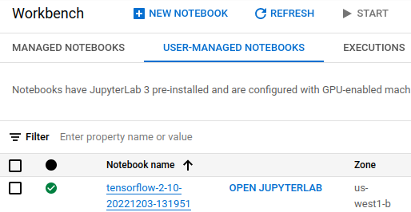
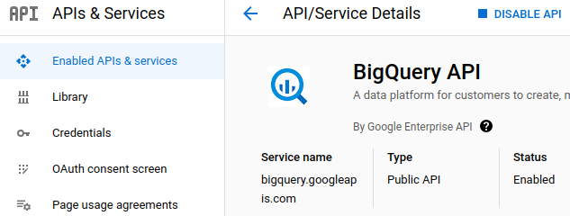
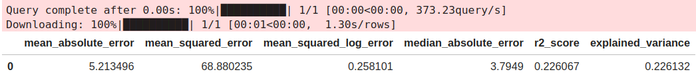
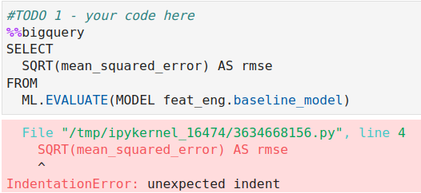

# Lab: Performing Basic Feature Engineering in BigQuery ML

Equivalently

- Basic Feature Engineering in BQML

## Learning objectives

1. Create SQL statements to evaluate the model
2. **Extract temporal features**
3. Perform **a feature cross on temporal features**

## Summary

- [training-data-analyst > courses > machine_learning > deepdive2 > **feature engineering > solutions**](https://github.com/GoogleCloudPlatform/training-data-analyst/tree/master/courses/machine_learning/deepdive2/feature_engineering/solutions)
  - [1_bqml_basic_feat_eng.ipynb](https://github.com/GoogleCloudPlatform/training-data-analyst/blob/master/courses/machine_learning/deepdive2/feature_engineering/solutions/1_bqml_basic_feat_eng.ipynb)

- I've added some additional comments in the following lines.
- Each learning objective will correspond to a #TODO in the student lab notebook

### Source code/excerpts from the solution

Lab Task 1 for the `baseline_model` is to write a SQL query to compute RMSE.

```SQL
%%bigquery
SELECT
  SQRT(mean_squared_error) AS rmse
FROM
  ML.EVALUATE(MODEL feat_eng.baseline_model)
```

The rest of Lab tasks (2, 3a and 3b) is almost identical. They are summarized in the following table.

|              | baseline_model      | model_1                                                     | model_2                                                     | model_3                                                      |
| ------------ | ------------------- | ----------------------------------------------------------- | ----------------------------------------------------------- | ------------------------------------------------------------ |
| Lab Task     |                     | 2                                                           | 3a                                                          | 3b                                                           |
| Summary      | raw feature is used | Day is too course to divide time well                       | hour is better than day                                     | feature cross is used!                                       |
| feature      | pickup_datetime     | dayofweek                                                   | hourofday                                                   | dayofweek & hourofday                                        |
| RMSE         | 8.299412            | 9.431944                                                    | 9.181624                                                    | 8.328029                                                     |
| Code snippet | pickup_datetime,    | EXTRACT(DAYOFWEEK   FROM     pickup_datetime) AS dayofweek, | EXTRACT(DAYOFWEEK   FROM     pickup_datetime) AS hourofday, | CONCAT(CAST(EXTRACT(DAYOFWEEK       FROM         pickup_datetime) AS STRING), CAST(EXTRACT(HOUR       FROM         pickup_datetime) AS STRING)) AS hourofday, |

**In fact, this lab does not make sense because the features and feature cross do no improve the performance or RMSE.**

### SQL statements to create a `model_n`. (Change n to the appropriate number, e.g. model_1.)

- The code snippet differs from model to model.
- The above table shows the corresponding code snippet.

```sql
%%bigquery
CREATE OR REPLACE MODEL
  feat_eng.model_n OPTIONS (model_type='linear_reg',
    input_label_cols=['fare_amount']) AS
SELECT
  fare_amount,
  passengers,
  #TODO the code snippet differs from model to model
  pickuplon,
  pickuplat,
  dropofflon,
  dropofflat
FROM
  `feat_eng.feateng_training_data`
```

Evaluate the model

```sql
%%bigquery
SELECT
  *
FROM
  ML.EVALUATE(MODEL feat_eng.model_n)
```

Calculate RMSE

```sql
%%bigquery
SELECT
  SQRT(mean_squared_error) AS rmse
FROM
  ML.EVALUATE(MODEL feat_eng.model_3)
```

## Introduction

The BQML code or SQL statements are run in Vertex AI Workbench. 



So both

- BigQuery
- Vertex AI

APIs should be enabled.

### Task 1. Enable APIs

1. On the **Navigation menu** (), click **APIs & services**.
2. Scroll down and confirm that your APIs are enabled.
3. If an API is missing, click **ENABLE APIS AND SERVICES** at the top, search for the API by name, and enable it for your project.

- [BigQuery](https://console.cloud.google.com/apis/library/bigquery.googleapis.com)



4. Enable Vertex AI APIs

## Source Code/Excerpts from the solution `.ipynb`

```
git clone https://github.com/GoogleCloudPlatform/training-data-analyst
```

### Create a BigQuery Dataset

A BigQuery dataset is a container for tables, views, and models built with BigQuery ML. Let's create one called feat_eng if we have not already done so in an earlier lab. We'll do the same for a GCS bucket for our project too.

```sql
%%bash
# Create a BigQuery dataset for feat_eng if it doesn't exist
datasetexists=$(bq ls -d | grep -w feat_eng)
# feat_eng

# If $datasetexists is none-zero
if [ -n "$datasetexists" ]; then
    echo -e "BigQuery dataset already exists, let's not recreate it."

else
    echo "Creating BigQuery dataset titled: feat_eng"
    
    bq --location=US mk --dataset \
        --description 'Taxi Fare' \
        $PROJECT:feat_eng
   echo "\nHere are your current datasets:"
   bq ls
fi
```

`feat_eng.feateng_training_data` is created from `nyc-tlc.yellow.trips`

```sql
%%bigquery 
CREATE OR REPLACE TABLE
  feat_eng.feateng_training_data AS
SELECT
  (tolls_amount + fare_amount) AS fare_amount,
  passenger_count*1.0 AS passengers,
  pickup_datetime,
  pickup_longitude AS pickuplon,
  pickup_latitude AS pickuplat,
  dropoff_longitude AS dropofflon,
  dropoff_latitude AS dropofflat
FROM
  `nyc-tlc.yellow.trips`
WHERE
  MOD(ABS(FARM_FINGERPRINT(CAST(pickup_datetime AS STRING))), 10000) = 1
  AND fare_amount >= 2.5
  AND passenger_count > 0
  AND pickup_longitude > -78
  AND pickup_longitude < -70
  AND dropoff_longitude > -78
  AND dropoff_longitude < -70
  AND pickup_latitude > 37
  AND pickup_latitude < 45
  AND dropoff_latitude > 37
  AND dropoff_latitude < 45
```

**Warning**: The following part fails if it's run on the latest TensorFlow Enterprise version, e.g. 2.10.

```
ERROR:
 _blocking_poll() got an unexpected keyword argument 'retry'
```

But it runs successfully on the TensorFlow Enterprise 2.6. So match the version correctly. 

1. On the Notebook instances page, click **New Notebook > TensorFlow Enterprise > TensorFlow Enterprise 2.6 (with LTS) > Without GPUs**.

To verify the creation of the table `feat_eng.feateng_training_data`, run

```sql
%%bigquery
# LIMIT 0 is a free query; this allows us to check that the table exists.
SELECT
*
FROM
  feat_eng.feateng_training_data
LIMIT
  0
```

shows the column names in the table.

```
	fare_amount	passengers	pickup_datetime	pickuplon	pickuplat	dropofflon	dropofflat
```

To see the sample values in the column names, change LIMIT to 1 or other number.

```sql
%%bigquery
# LIMIT 0 is a free query; this allows us to check that the table exists.

SELECT
  *
FROM
  feat_eng.feateng_training_data
LIMIT
  1
```

shows

```
	fare_amount	passengers	pickup_datetime	pickuplon	pickuplat	dropofflon	dropofflat
0	2.5	2.0	2010-07-16 21:10:00+00:00	-73.987632	40.702428	-73.987548	40.702332
```

### Baseline Model: Create the baseline model

Create a model `feat_eng.baseline_model` from the training dataset `feat_eng.feateng_training_data` as follows.

```sql
%%bigquery

CREATE OR REPLACE MODEL
  feat_eng.baseline_model OPTIONS (model_type='linear_reg',
    input_label_cols=['fare_amount']) AS
SELECT
  fare_amount,
  passengers,
  pickup_datetime, # This will be the TODO for the later lab tasks.
  pickuplon,
  pickuplat,
  dropofflon,
  dropofflat
FROM
  feat_eng.feateng_training_data
```

### Evaluate the baseline mode

Using the model `feat_eng.baseline_model`, the eval stats can be obtained.

```sql
%%bigquery
SELECT
  *,
  SQRT(loss) AS rmse
FROM
  ML.TRAINING_INFO(MODEL feat_eng.baseline_model)
```

The outputs is

```
	training_run	iteration	loss	eval_loss	learning_rate	duration_ms	rmse
0	0	0	74.435379	68.880235	NaN	8933	8.627594
```

`ML.EVALUATE` evaluate the model.

```sql
%%bigquery
SELECT
  *
FROM
  ML.EVALUATE(MODEL feat_eng.baseline_model)
```



**Lab Task 1:** Next, we write a SQL query to take the SQRT() of the mean squared error as your loss metric for evaluation for the benchmark_model.

```sql
%%bigquery
#TODO 1 - your code here
SELECT
  SQRT(mean_squared_error) AS rmse
FROM
  ML.EVALUATE(MODEL feat_eng.baseline_model)
```

- Problem: `IndentationError: unexpected indent`occurs when the first line starts from a comment.

- Solution: Start the first line from `%%bigquery` as above.



#### Model 1: EXTRACT dayofweek from the pickup_datetime feature.

**Lab Task 2:** Next, we create a model titled "model_1" from the benchmark model and **extract out the DayofWeek**.

- Create `model_1`
- `dayofweek` is extracted from **day of week**.

- The resulting RMSE is 9.431944.

```sql
  #TODO 2 - Your code here
  EXTRACT(DAYOFWEEK
  FROM
    pickup_datetime) AS dayofweek,
```

### Model 2: EXTRACT hourofday from the pickup_datetime feature

**Lab Task 3a:** Next, we create a model titled "model_2" and EXTRACT the hourofday from the pickup_datetime feature to improve our model's rmse.

- Create a model `feat_eng.model_2` 
- `hourofday` is extracted from the `pickup_datetime` feature. 
- The resulting RMSE is 9.181624.

```sql
   #TODO 3a -- Your code here 
  EXTRACT(DAYOFWEEK
  FROM
    pickup_datetime) AS hourofday,
```

The entire SQL statements are below.

```sql
%%bigquery
CREATE OR REPLACE MODEL
  feat_eng.model_2 OPTIONS (model_type='linear_reg',
    input_label_cols=['fare_amount']) AS
SELECT
  fare_amount,
  passengers,

   #TODO 3a -- Your code here 
  EXTRACT(DAYOFWEEK
  FROM
    pickup_datetime) AS hourofday,
  pickuplon,
  pickuplat,
  dropofflon,
  dropofflat
FROM
  `feat_eng.feateng_training_data`
```

### Model 3: Feature cross dayofweek and hourofday using CONCAT

**Lab Task 3b:** Create the SQL statement to **feature cross the dayofweek and hourofday** using the CONCAT function. Name the model "model_3"

- Create a model `feat_eng.model_3` 
- **the feature cross the dayofweek and hourofday** 
  - the CONCAT function is used to create the feature cross.
- The resulting RMSE is 8.328029.

```sql
  #TODO 3b -- Your code here  
  CONCAT(CAST(EXTRACT(DAYOFWEEK
      FROM
        pickup_datetime) AS STRING), CAST(EXTRACT(HOUR
      FROM
        pickup_datetime) AS STRING)) AS hourofday, 
```

The entire SQL statements are below.

```sql
%%bigquery

CREATE OR REPLACE MODEL
  feat_eng.model_3 OPTIONS (model_type='linear_reg',
    input_label_cols=['fare_amount']) AS
SELECT
  fare_amount,
  passengers,

  #TODO 3b -- Your code here  
  CONCAT(CAST(EXTRACT(DAYOFWEEK
      FROM
        pickup_datetime) AS STRING), CAST(EXTRACT(HOUR
      FROM
        pickup_datetime) AS STRING)) AS hourofday,  
  pickuplon,
  pickuplat,
  dropofflon,
  dropofflat
FROM
  `feat_eng.feateng_training_data`
```
