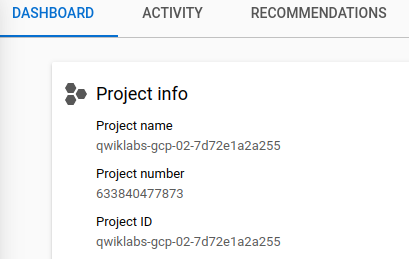
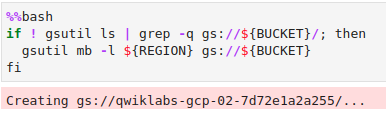

# Lab: Exploring tf.transform

## Summary

- I've added some additional comments in the following lines.
- Each learning objective will correspond to a #TODO in the student lab notebook

## Introduction

- [training-data-analyst > courses > machine_learning > deepdive2 > **feature_engineering**  > labs](https://github.com/GoogleCloudPlatform/training-data-analyst/tree/master/courses/machine_learning/deepdive2/feature_engineering/labs)
- [training-data-analyst > courses > machine_learning > deepdive2 > **feature engineering > solutions**](https://github.com/GoogleCloudPlatform/training-data-analyst/tree/master/courses/machine_learning/deepdive2/feature_engineering/solutions)
  - [5_tftransform_taxifare.ipynb](https://github.com/GoogleCloudPlatform/training-data-analyst/blob/master/courses/machine_learning/deepdive2/feature_engineering/solutions/5_tftransform_taxifare.ipynb)

- Apache Beam > Pandas
  - While Pandas is fine for experimenting, for operationalization of your workflow it is better to do preprocessing in Apache Beam. 
  - This will also help if you need to preprocess data in flight since Apache Beam allows for streaming. 

- In this lab we will pull data from BigQuery then **use Apache Beam TfTransform to process the data**.
  - Only specific combinations of TensorFlow/Beam are supported by tf.transform so make sure to get a combo that works. In this lab we will be using:
    - TFT 0.24.0
    - TF 2.3.0
    - Apache Beam [GCP] 2.24.0


### Learning objectives

1. Preprocess data and engineer new features **using TfTransform**.
2. Create and deploy **Apache Beam pipeline**.
3. Use processed data to **train taxifare model locally** then serve a prediction.

## Source code/Excerpts from the solution `.ipynb`

```bash
git clone https://github.com/GoogleCloudPlatform/training-data-analyst
```

### Create ML dataset using tf.transform and Dataflow

```markdown
BigQuery data --> Cloud Dataflow --> TFRecord files
```

Let's use Cloud Dataflow to read in the BigQuery data and write it out as TFRecord files. 

- Along the way, let's use tf.transform to do scaling and transforming. 
- Using tf.transform allows us to save the metadata to ensure that the appropriate transformations get carried out during prediction as well.

`transformed_data` is type `pcollection`.


### Code change

```python
# change these to try this notebook out
PROJECT = 'qwiklabs-gcp-02-7d72e1a2a255'
BUCKET = PROJECT
REGION = "us-central1"  # keep this as it is.
```


### Problem

Bucket creation fails with the following error.

```bash
CalledProcessError: Command 'b'if ! gsutil ls | grep -q gs://${BUCKET}/; then\n  gsutil mb -l ${REGION} gs://${BUCKET}\nfi\n'' returned non-zero exit status 1.
```

#### Source code, Project ID and Vertex AI Workbench region

The code is actually from the `.ipynb`, but the values for `PROJECT`, `BUCKET`, and `REGION` are changed by me.




```python
# change these to try this notebook out
PROJECT = 'qwiklabs-gcp-02-7d72e1a2a255'
BUCKET = PROJECT
REGION = 'us-west1-b'

import os
os.environ['BUCKET'] = BUCKET
os.environ['PROJECT'] = PROJECT
os.environ['REGION'] = REGION
```

```bash
%%bash
gcloud config set project $PROJECT
gcloud config set compute/region $REGION

if ! gsutil ls | grep -q gs://${BUCKET}/; then
  gsutil mb -l ${REGION} gs://${BUCKET}
fi
```

```bash
Creating gs://qwiklabs-gcp-02-7d72e1a2a255/...
BadRequestException: 400 The specified location constraint is not valid.
---------------------------------------------------------------------------
  ...
CalledProcessError: Command 'b'if ! gsutil ls | grep -q gs://${BUCKET}/; then\n  gsutil mb -l ${REGION} gs://${BUCKET}\nfi\n'' returned non-zero exit status 1.
```

### Solution

- Change ONLY `PROJECT` and `BUCKET` to the PROJECT ID.
- Leave `REGION` as it is.
  - While the Jupyterlab is in `REGION = 'us-west1-b'`, do not use this region.

```python
# change these to try this notebook out
PROJECT = 'qwiklabs-gcp-02-7d72e1a2a255'
BUCKET = PROJECT
REGION = 'us-central1'  # Leave this as it is.
```

Doing so will create the bucket successfully.



### Problem

In the following lines,

-  `head()` function is used to get the first n rows of dataframe
- `describe()` is use to get the statistical summary of the DataFrame

```python
df_valid = bigquery.Client().query(query).to_dataframe()
display(df_valid.head())
df_valid.describe()
```

Running the above three lines results in the following error.

```python
---------------------------------------------------------------------------
ModuleNotFoundError                       Traceback (most recent call last)
/tmp/ipykernel_16769/3787544405.py in <module>
----> 1 df_valid = bigquery.Client().query(query).to_dataframe()
      2 
      3 # `head()` function is used to get the first n rows of dataframe
      4 display(df_valid.head())
      5 
...

ModuleNotFoundError: No module named 'pyarrow.vendored.version'
```

### Hint

Actually the 1st error causes the `ModuleNotFoundError`.

```python
df_valid = bigquery.Client().query(query).to_dataframe()
```

```python
---------------------------------------------------------------------------
ModuleNotFoundError                       Traceback (most recent call last)
/tmp/ipykernel_16769/2167275648.py in <module>
----> 1 df_valid = bigquery.Client().query(query).to_dataframe()
  ...
ModuleNotFoundError: No module named 'pyarrow.vendored.version'
```

### Problem

Previously installing some packegets includes the following errors.

```python
!pip install tensorflow==2.3.0 tensorflow-transform==0.24.0 apache-beam[gcp]==2.24.0
```

results in

```python
ERROR: pip's dependency resolver does not currently take into account all the packages that are installed. This behaviour is the source of the following dependency conflicts.
witwidget 1.8.1 requires oauth2client>=4.1.3, but you have oauth2client 3.0.0 which is incompatible.
pydantic 1.10.2 requires typing-extensions>=4.1.0, but you have typing-extensions 3.7.4.3 which is incompatible.
phik 0.12.2 requires scipy>=1.5.2, but you have scipy 1.4.1 which is incompatible.
google-cloud-storage 2.5.0 requires google-cloud-core<3.0dev,>=2.3.0, but you have google-cloud-core 1.7.3 which is incompatible.
google-cloud-storage 2.5.0 requires google-resumable-media>=2.3.2, but you have google-resumable-media 1.3.3 which is incompatible.
google-cloud-pubsublite 1.6.0 requires google-cloud-pubsub<3.0.0dev,>=2.10.0, but you have google-cloud-pubsub 1.7.2 which is incompatible.
google-cloud-logging 3.2.5 requires google-cloud-core<3.0.0dev,>=2.0.0, but you have google-cloud-core 1.7.3 which is incompatible.
cloud-tpu-client 0.10 requires google-api-python-client==1.8.0, but you have google-api-python-client 1.12.11 which is incompatible.
black 22.10.0 requires typing-extensions>=3.10.0.0; python_version < "3.10", but you have typing-extensions 3.7.4.3 which is incompatible.
```

And the following command

```python
!pip install --user google-cloud-bigquery==1.25.0
```

results in

```python
ERROR: pip's dependency resolver does not currently take into account all the packages that are installed. This behaviour is the source of the following dependency conflicts.
google-cloud-storage 2.5.0 requires google-cloud-core<3.0dev,>=2.3.0, but you have google-cloud-core 1.7.3 which is incompatible.
google-cloud-storage 2.5.0 requires google-resumable-media>=2.3.2, but you have google-resumable-media 0.5.1 which is incompatible.
google-cloud-pubsublite 1.6.0 requires google-cloud-pubsub<3.0.0dev,>=2.10.0, but you have google-cloud-pubsub 1.7.2 which is incompatible.
google-cloud-logging 3.2.5 requires google-cloud-core<3.0.0dev,>=2.0.0, but you have google-cloud-core 1.7.3 which is incompatible.
cloud-tpu-client 0.10 requires google-api-python-client==1.8.0, but you have google-api-python-client 1.12.11 which is incompatible.
```

### Hint

Google search: how to install google-cloud-core

- https://pypi.org/project/google-cloud-core/

```bash
$ pip install --upgrade google-cloud-core
```

Run the following command

```python
!pip install google-cloud-core
```

and run the installation command again.

```python
!pip install tensorflow==2.3.0 tensorflow-transform==0.24.0 apache-beam[gcp]==2.24.0
```

```python
!pip install --user google-cloud-bigquery==1.25.0
```

The only remaining error is

```python
ERROR: pip's dependency resolver does not currently take into account all the packages that are installed. This behaviour is the source of the following dependency conflicts.
cloud-tpu-client 0.10 requires google-api-python-client==1.8.0, but you have google-api-python-client 1.12.11 which is incompatible.
```

`cloud-tpu-client` is not used, so we should be able to ignore the above error.

### Hint

The original error

```python
ModuleNotFoundError: No module named 'pyarrow.vendored.version'
```

is still there.

Google search: ModuleNotFoundError: No module named 'pyarrow.vendored.version'

- [ModuleNotFoundError: No module named 'pyarrow'](https://stackoverflow.com/questions/52320336/modulenotfounderror-no-module-named-pyarrow), Stack overflow

I had the same problem in a AWS EMR. I tried the other answers but they didn't work. The only solution worked for me was install pyarrow with pip instead conda. I really don't know why, but it can be useful if you have same problem.

```python
pip install pyarrow
```

### Attempt

```python
!pip install pyarrow
```

```python
Requirement already satisfied: pyarrow in /opt/conda/lib/python3.7/site-packages (0.17.1)
Requirement already satisfied: numpy>=1.14 in /opt/conda/lib/python3.7/site-packages (from pyarrow) (1.18.5)
```

didn't resolve the issue.

```python
print(query)
```

outputs

```python
    WITH daynames AS
    (SELECT ['Sun', 'Mon', 'Tues', 'Wed', 'Thurs', 'Fri', 'Sat'] AS daysofweek)
    SELECT
    (tolls_amount + fare_amount) AS fare_amount,
    daysofweek[ORDINAL(EXTRACT(DAYOFWEEK FROM pickup_datetime))] AS dayofweek,
    EXTRACT(HOUR FROM pickup_datetime) AS hourofday,
    pickup_longitude AS pickuplon,
    pickup_latitude AS pickuplat,
    dropoff_longitude AS dropofflon,
    dropoff_latitude AS dropofflat,
    passenger_count AS passengers,
    'notneeded' AS key
    FROM
    `nyc-tlc.yellow.trips`, daynames
    WHERE
    trip_distance > 0 AND fare_amount > 0
     AND ABS(MOD(FARM_FINGERPRINT(CAST(
        pickup_datetime AS STRING)), 100000)) = 2
```

### Hint

Google search: bigquery.Client().query(query).to_dataframe()

- BigQuery > Doc. > Samples
  - [Create a client with application default credentials](https://cloud.google.com/bigquery/docs/samples/bigquery-client-default-credentials#bigquery_client_default_credentials-python) > [Code sample](https://cloud.google.com/bigquery/docs/samples/bigquery-client-default-credentials#code-sample)
  - [Download query results to DataFrame](https://cloud.google.com/bigquery/docs/samples/bigquery-query-results-dataframe) > [Code sample](https://cloud.google.com/bigquery/docs/samples/bigquery-query-results-dataframe#code-sample)

The following code samples are from the official documentation.

```python
# https://cloud.google.com/bigquery/docs/samples/bigquery-client-default-credentials#bigquery_client_default_credentials-python
from google.cloud import bigquery

# If you don't specify credentials when constructing the client, the
# client library will look for credentials in the environment.
client = bigquery.Client()

# https://cloud.google.com/bigquery/docs/samples/bigquery-query-results-dataframe
test_sql = """
    SELECT name, SUM(number) as count
    FROM `bigquery-public-data.usa_names.usa_1910_current`
    GROUP BY name
    ORDER BY count DESC
    LIMIT 10
"""

df = client.query(test_sql).to_dataframe()
```

Running the above code samples yields the same error message!

```python
ModuleNotFoundError: No module named 'pyarrow.vendored.version'
```

It looks like this is an version issue. Recall the ignored error.

```python
ERROR: pip's dependency resolver does not currently take into account all the packages that are installed. This behaviour is the source of the following dependency conflicts.
cloud-tpu-client 0.10 requires google-api-python-client==1.8.0, but you have google-api-python-client 1.12.11 which is incompatible.
```

Let's uninstall the recent version of `1.12.11` 

```python
!pip uninstall -y google-api-python-client
```

```bash
Found existing installation: google-api-python-client 1.12.11
Uninstalling google-api-python-client-1.12.11:
  Successfully uninstalled google-api-python-client-1.12.11
```

and install an older version of `1.8.0`.

```python
!pip install google-api-python-client==1.8.0
```

```bash
Requirement already satisfied: google-api-python-client==1.8.0 in /opt/conda/lib/python3.7/site-packages (1.8.0)
Requirement already satisfied: uritemplate<4dev,>=3.0.0 in /opt/conda/lib/python3.7/site-packages (from google-api-python-client==1.8.0) (3.0.1)
Requirement already satisfied: google-auth-httplib2>=0.0.3 in /opt/conda/lib/python3.7/site-packages (from google-api-python-client==1.8.0) (0.1.0)
Requirement already satisfied: httplib2<1dev,>=0.9.2 in /opt/conda/lib/python3.7/site-packages (from google-api-python-client==1.8.0) (0.17.4)
Requirement already satisfied: google-api-core<2dev,>=1.13.0 in /home/jupyter/.local/lib/python3.7/site-packages (from google-api-python-client==1.8.0) (1.34.0)
Requirement already satisfied: six<2dev,>=1.6.1 in /opt/conda/lib/python3.7/site-packages (from google-api-python-client==1.8.0) (1.16.0)
Requirement already satisfied: google-auth>=1.4.1 in /opt/conda/lib/python3.7/site-packages (from google-api-python-client==1.8.0) (1.35.0)
Requirement already satisfied: protobuf!=3.20.0,!=3.20.1,!=4.21.0,!=4.21.1,!=4.21.2,!=4.21.3,!=4.21.4,!=4.21.5,<4.0.0dev,>=3.19.5 in /opt/conda/lib/python3.7/site-packages (from google-api-core<2dev,>=1.13.0->google-api-python-client==1.8.0) (3.19.6)
Requirement already satisfied: requests<3.0.0dev,>=2.18.0 in /opt/conda/lib/python3.7/site-packages (from google-api-core<2dev,>=1.13.0->google-api-python-client==1.8.0) (2.28.1)
Requirement already satisfied: googleapis-common-protos<2.0dev,>=1.56.2 in /opt/conda/lib/python3.7/site-packages (from google-api-core<2dev,>=1.13.0->google-api-python-client==1.8.0) (1.56.4)
Requirement already satisfied: rsa<5,>=3.1.4 in /opt/conda/lib/python3.7/site-packages (from google-auth>=1.4.1->google-api-python-client==1.8.0) (4.9)
Requirement already satisfied: cachetools<5.0,>=2.0.0 in /opt/conda/lib/python3.7/site-packages (from google-auth>=1.4.1->google-api-python-client==1.8.0) (3.1.1)
Requirement already satisfied: pyasn1-modules>=0.2.1 in /opt/conda/lib/python3.7/site-packages (from google-auth>=1.4.1->google-api-python-client==1.8.0) (0.2.7)
Requirement already satisfied: setuptools>=40.3.0 in /opt/conda/lib/python3.7/site-packages (from google-auth>=1.4.1->google-api-python-client==1.8.0) (59.8.0)
Requirement already satisfied: pyasn1<0.5.0,>=0.4.6 in /opt/conda/lib/python3.7/site-packages (from pyasn1-modules>=0.2.1->google-auth>=1.4.1->google-api-python-client==1.8.0) (0.4.8)
Requirement already satisfied: certifi>=2017.4.17 in /opt/conda/lib/python3.7/site-packages (from requests<3.0.0dev,>=2.18.0->google-api-core<2dev,>=1.13.0->google-api-python-client==1.8.0) (2022.9.24)
Requirement already satisfied: urllib3<1.27,>=1.21.1 in /opt/conda/lib/python3.7/site-packages (from requests<3.0.0dev,>=2.18.0->google-api-core<2dev,>=1.13.0->google-api-python-client==1.8.0) (1.26.11)
Requirement already satisfied: charset-normalizer<3,>=2 in /opt/conda/lib/python3.7/site-packages (from requests<3.0.0dev,>=2.18.0->google-api-core<2dev,>=1.13.0->google-api-python-client==1.8.0) (2.1.1)
Requirement already satisfied: idna<4,>=2.5 in /opt/conda/lib/python3.7/site-packages (from requests<3.0.0dev,>=2.18.0->google-api-core<2dev,>=1.13.0->google-api-python-client==1.8.0) (3.4)
```


- [BigQuery data to Pandas DataFrame - Kaggle](https://www.kaggle.com/getting-started/188152)

Convert BQTable as Pandas DataFrame

```python
# Import dependancies
import pandas as pd

# Google
import google
from google.cloud import bigquery_storage
from google.cloud import bigquery

# Construct a BigQuery client object.
credentials, project_id = google.auth.default()
client = bigquery.Client()

query = """SELECT field1, field2, …, fieldn FROM project_name.table
ETC…"""

def get_data(sql_query):

    # Make an API request.
    query_job = client.query(sql_query)

    # Convert as dataframe
    dataframe = (
        query_job
        .result()
        .to_dataframe()
    )

    return dataframe

df = get_data(sql_query = query)
```

```bash
---------------------------------------------------------------------------
TypeError                                 Traceback (most recent call last)
/tmp/ipykernel_24090/2120102645.py in <module>
     28     return dataframe
     29 
---> 30 df = get_data(sql_query = query)

/tmp/ipykernel_24090/2120102645.py in get_data(sql_query)
     21     # Convert as dataframe
     22     dataframe = (
---> 23         query_job
     24         .result()
     25         .to_dataframe()

~/.local/lib/python3.7/site-packages/google/cloud/bigquery/job.py in result(self, page_size, max_results, retry, timeout, start_index)
   3205         """
   3206         try:
-> 3207             super(QueryJob, self).result(retry=retry, timeout=timeout)
   3208 
   3209             # Return an iterator instead of returning the job.

~/.local/lib/python3.7/site-packages/google/cloud/bigquery/job.py in result(self, retry, timeout)
    810             self._begin(retry=retry, timeout=timeout)
    811         # TODO: modify PollingFuture so it can pass a retry argument to done().
--> 812         return super(_AsyncJob, self).result(timeout=timeout)
    813 
    814     def cancelled(self):

~/.local/lib/python3.7/site-packages/google/api_core/future/polling.py in result(self, timeout, retry, polling)
    254         """
    255 
--> 256         self._blocking_poll(timeout=timeout, retry=retry, polling=polling)
    257 
    258         if self._exception is not None:

TypeError: _blocking_poll() got an unexpected keyword argument 'retry'
```

### Hint

```bash
TypeError: _blocking_poll() got an unexpected keyword argument 'retry'
```

Google search: TypeError: _blocking_poll() got an unexpected keyword argument 'retry'


