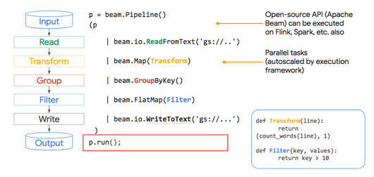
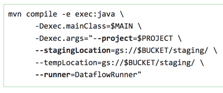

# Quiz: Preprocessing and Feature Creation

### Your grade: 57.14% --> 85.71% --> 100%

Question 1
Which of these accurately describes the relationship between Apache Beam and Cloud Dataflow?

```
Is this true? 
* two are not compatible.
```

- [x] Cloud Dataflow is the API for data pipeline building in **java or python** and Apache Beam is the implementation and execution framework.

- [ ] 
  They are the same.

- [ ] Cloud Dataflow is the proprietary version of the Apache Beam API and the two are not compatible.

Question 2
True or False: The Filter method can be carried out in parallel and autoscaled by the execution framework:

 

- [x] 
  True: Anything in Map or FlatMap can be parallelized by the Beam execution framework.

- [ ] 
  False: Anything in Map or FlatMap can be parallelized by the Beam execution framework.


Question 3
What is the purpose of a Cloud Dataflow connector?

**.apply(TextIO.write().to(“gs://…”));**

- [x] Connectors allow you to output the results of a pipeline to a specific data sink like Bigtable, Google Cloud Storage, flat file, BigQuery, and more. **(guess)**

- [ ] 
  Connectors allow you to chain multiple data-processing steps together automatically so they process in parallel.

- [ ] 
  Connectors allow you to authenticate your pipeline as specific users who may have greater access to datasets.


Question 4
To run a pipeline you need something called a ________.

```
The meaning of runner and executor is identical.
Apache Beam is the execution framework!
```

- [x] runner **(guess)**

- [ ] 
  executor

- [ ] 
  pipeline

- [ ] 
  Apache Beam 


Question 5
Your development team is about to execute this code block. What is your team about to do?

 

- [x] 
  We are compiling our Cloud Dataflow pipeline written in Java and are submitting it to the cloud for execution.


​	Notice that we are calling mvn compile and passing in --runner=DataflowRunner.

- [ ] 
  We are compiling our Cloud Dataflow pipeline written in Python and are loading the outputs of the executed pipeline inside of Google Cloud Storage (gs://)

- [ ] 
  We are preparing a staging area in Google Cloud Storage for the output of our Cloud Dataflow pipeline and will be submitting our BigQuery job with a later command.


Question 6
True or False: A **ParDo** acts on all items at once (like a Map in MapReduce).

```
No idea! This has not been covered in the Coursera videos, I believe.
```

- [ ] True **(wrong guess)**

- [x] 
  False. A ParDo acts on one item at a time (like a Map in MapReduce)


Question 7
What is one key advantage of preprocessing your features using Apache Beam?

- [x] The same code you use to preprocess features in training and evaluation can also be used in serving.

- [ ] 
  Apache Beam transformations are written in Standard SQL which is scalable and easy to author.

- [ ] 
  Apache Beam code is often harder to maintain and run at scale than BigQuery preprocessing pipelines.
