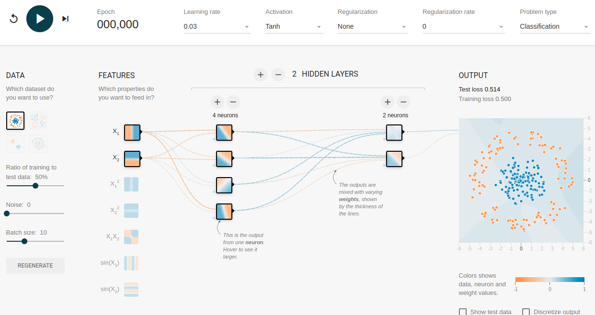

# Quiz: Feature Crosses - TensorFlow Playground

Question 1
True or False: We can create many different kinds of feature crosses. For example:

- [A X B]: a feature cross formed by multiplying the values of two features.
- [A x B x C x D x E]: a feature cross formed by multiplying the values of five features.

- [A x A]: a feature cross formed by squaring a single feature. 

- [x] True

- [ ] 
  False


Question 2
True or False: In TensorFlow Playground, orange and blue are used throughout the visualization in slightly different ways, but in general orange shows negative values while blue shows positive values.

- [x] True

- [ ] False (my wrong guess)

```
The color can be quite confusing. So take a look at the homepage. A screenshot is below.
```



source: [TensorFlow Playground](https://playground.tensorflow.org/#activation=tanh&batchSize=10&dataset=circle&regDataset=reg-plane&learningRate=0.03&regularizationRate=0&noise=0&networkShape=4,2&seed=0.80129&showTestData=false&discretize=false&percTrainData=50&x=true&y=true&xTimesY=false&xSquared=false&ySquared=false&cosX=false&sinX=false&cosY=false&sinY=false&collectStats=false&problem=classification&initZero=false&hideText=false)

Question 3
True or False: In TensorFlow Playground, the data points (represented by small circles) are initially colored orange or blue, which correspond to zero and negative one.

- [ ] True

- [x] False

Question 4
Fill in the blanks: In the ____ layers, the lines are colored by the ____ of the connections between neurons. Blue shows a ____ weight, which means the network is using that ____ **of the neuron as given**. An orange line shows that the network is assigning a ____ weight. 

```
Not sure of the meaming
the networks is using that "output of the neuron as given"
```

- [ ] Hidden, weights, negative, output, positive

- [x] 
  Hidden, weights, positive, output, negative

- [ ] 
  Weights, hidden, negative, output, positive

- [ ] Output, weights, negative, hidden, positive

Question 5
True or False: In TensorFlow Playground, in the output layer, the dots are colored orange or blue depending on their original values. The background color shows what the network is predicting for a particular area. The intensity of the color shows how confident that prediction is.

- [x] True (guess)

- [ ] 
  False


Question 6
Why might you create an embedding of a feature cross?

- [ ] To create a lower-dimensional representation of the input space

- [ ] 
  To identify similar sets of inputs for clustering

- [ ] 
  To reuse weights learned in one problem in another problem

- [x] 
  All of the options are correct.
