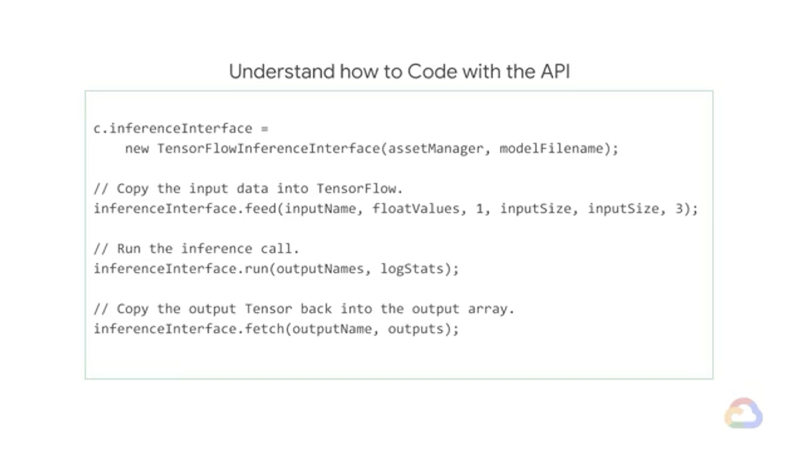

# Quiz: Hybrid ML systems

**50% -> 100%**

Question 1

Which of these are reasons that you may not be able to perform machine learning solely on Google Cloud? Check all that apply.

- [x] You are tied to on-premises or multi-cloud infrastructure due to business reasons.
- [x] You need to run inference on the edge.
- [ ] TensorFlow is not supported on Google Cloud.


Question 2

A key principle behind Kubeflow is portability so that you can:

- [x] Move your model from on-premises to Google Cloud.
- [ ] Migrate your model from TensorFlow to PyTorch.
- [ ] Convert your model from CUDA to XLA.


Question 3

Which of the following determines the correct property of Tensorflow Lite?

```
2~4 are not the whole reason, so I think 1 might be the answer.
What exactly it means by "Increased code footprint"?

footprint

정보기술에서, footprint란 특정 하드웨어나 소프트웨어 단위가 차지하고 있는 공간의 크기를 말한다. 만약 마케팅 브로슈어에서, 새로운 하드웨어 유니트나 데스크탑 디스플레이가 "더 작은 footprint를 갖는다"라는 설명을 했다면, 그것이 방이나 책상 위에서 차지하는 공간이 전보다 더 작아졌다는 것을 의미한다. 최근에 이 용어는, 컴퓨터의 내부 공간을 적게 차지하는 마이크로컴포넌트들이나, 메모리를 적게 차지하는 소프트웨어를 가리키는데 사용된다. 
- source: http://www.terms.co.kr/footprint.htm

Well, 1 means increased space for code. I don't think this is the right answer.

TF Lite does both quantization & lower precision arithmetic.
- I don't think this is a good question.
- But I can't simply complain, so let's focus on "Lite".
--> Lower precision 
```

- [ ] Increased code footprint
- [x] Quantization
- [ ] Higher precision arithmetic
- [ ] Lower precision arithmetic (wrong answer)


Question 4

To copy the input data into TensorFlow, which of the following syntaxes is correct?

- [ ] inferenceInterface.feed(floatValues, 1, inputSize, inputSize, 3);
- [ ] inferenceInterface.feed(inputName, floatValues, 1, inputSize; inputSize, 3);
- [x] inferenceInterface.feed(inputName, floatValues, 1, inputSize, inputSize, 3);
- [ ] inferenceInterface.feed(inputName, floatValues, 1, inputSize, 3); **(wrong guess)**

```
I remember the 1st argument should be inputName. --> 2-4.
Among 2-4, the 2nd~4th arguments are identical. 2 & 3 are identical. So let's select 4.

But what does 3 means? Aha, the total number of arguments? Then 4 is right.
```

Ah, OK. I reviewed the video. And either 2 or 3 is right. What's the difference?

inferenceInterface.feed(inputName, floatValues, 1, inputSize**;** inputSize, 3);

; is used instead of , for 2. Come!!! What kind of problem is this?
